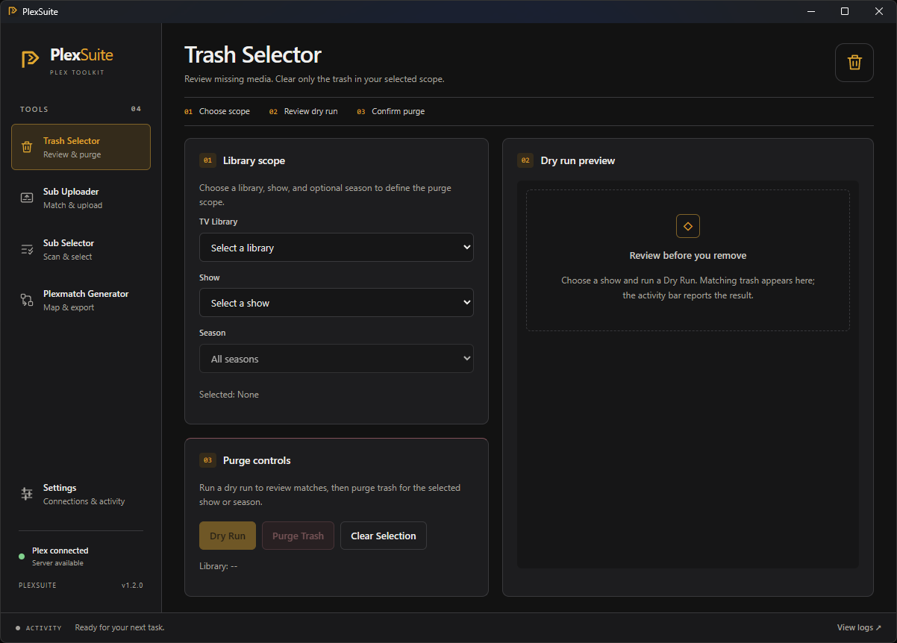
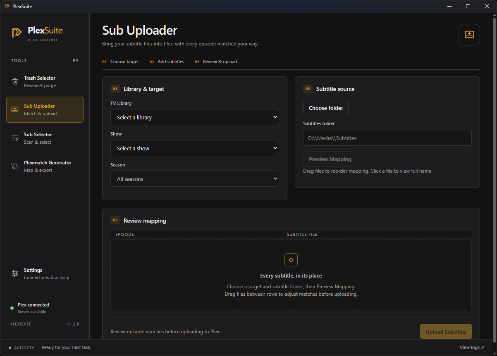
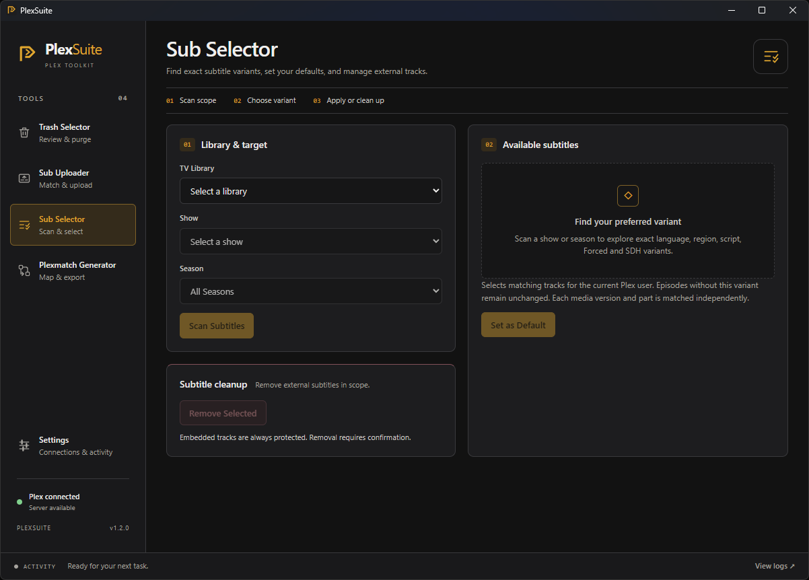
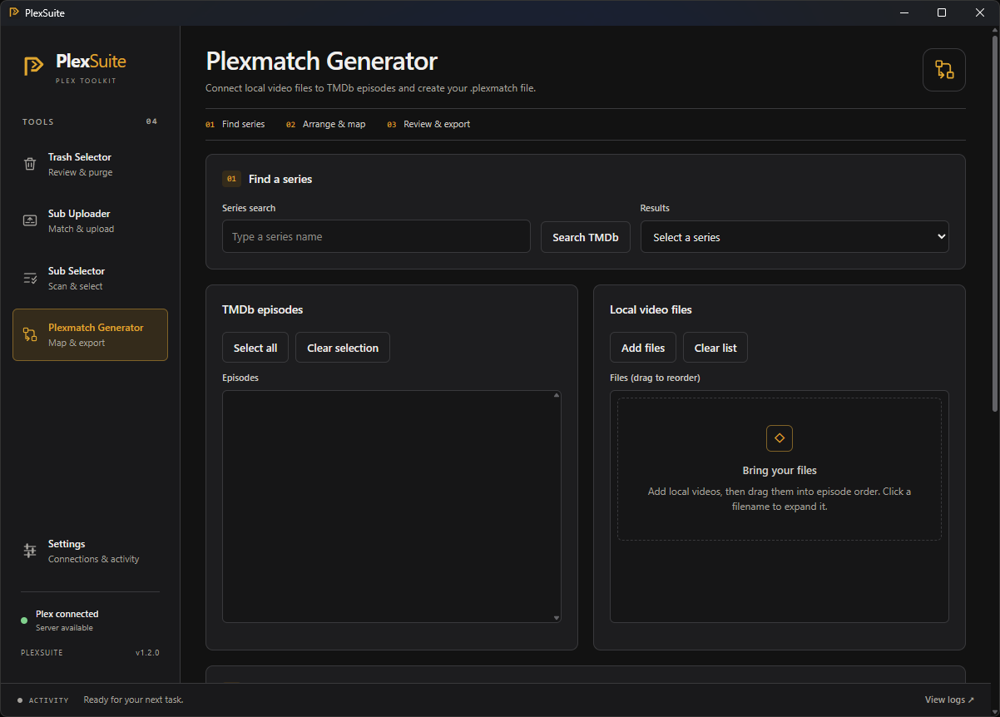

# PlexSuite

**A portable desktop toolkit for Plex TV libraries.**

Fine-grained trash cleanup, subtitle management, subtitle uploads, and `.plexmatch` generation — in one lightweight desktop app.

[**Download latest release**](https://github.com/Danavans/PlexSuite/releases/latest)

---

  

## What is PlexSuite?

PlexSuite is a small desktop toolkit built around everyday Plex library tasks that can otherwise be too broad, repetitive, or awkward to manage.

It does not replace Plex. Instead, it adds a few focused tools for situations where you need more control over a particular show, season, subtitle set, or file mapping.

PlexSuite is portable on Windows: download the executable, launch it, connect to your Plex server, and use the tool you need. No installer is required.

Multiple Plex servers can be saved in Settings and switched globally from the sidebar. The selected server becomes the active context for Plex-related tools, without adding extra server selectors inside each workflow.

## Tools

### Trash Selector

Plex's **Empty Trash** action works at the library level, but sometimes you only want to remove stale entries from one particular show or season.

For example, some missing media may be temporary and should remain in Plex until the files are restored, while other entries may belong to old media versions that have already been replaced and can safely be removed.

Trash Selector lets you handle those cases separately instead of emptying the trash for the entire library.

**Usage**

1. Select a Plex TV library.
2. Choose a show and, optionally, a season.
3. Run a **Dry Run**.
4. Review the affected episodes, displayed as `S01E01 - Episode Title`.
5. Purge the entries once the preview matches what you expect.

---

### Sub Selector

Plex libraries can contain several subtitle variants for the same language — for example different regions, regular versus SDH subtitles, Forced tracks, or multiple combinations of them.

Sub Selector lets you inspect exactly what is available and choose the variant you want across an entire show or season, rather than correcting episodes one by one.

It can also clean up external subtitles that are no longer needed, including subtitles previously uploaded to Plex or sidecar subtitle files.

**Usage**

1. Select a library, show, and season — or scan all seasons.
2. Click **Scan Subtitles**.
3. Choose the exact language, region/script, Forced, and SDH variant you want.
4. Use **Set as Default** to select matching tracks for the Plex user associated with your token.
5. Use **Subtitle Cleanup** when you want to remove selected external subtitle categories.

Embedded subtitles are part of the media file itself and cannot be removed by this cleanup.

---

### Sub Uploader

Sometimes subtitle files cannot simply be placed next to the video files.

This is particularly useful with read-only media storage, remote mounts, WebDAV libraries, or other setups where the media directory itself cannot easily be modified.

Sub Uploader lets you send subtitle files directly to Plex without requiring them to live alongside the video files.

**Usage**

1. Select the matching Plex library, show, and season.
2. Choose a local folder containing subtitle files.
3. Preview the automatic episode matching.
4. Adjust the mapping manually if necessary.
5. Upload the matched subtitles to Plex in bulk.

---

### Plexmatch Generator

A `.plexmatch` file tells Plex how local files should map to a series or episode structure when filenames alone do not provide the correct season and episode numbering.

This can be especially useful with anime, alternative release structures, or read-only libraries where renaming the actual media files is not practical.

Plexmatch Generator turns what can otherwise be a repetitive manual mapping process into a quick visual workflow.

**Usage**

1. Search for the series using TMDb.
2. Load your local video files.
3. Select the corresponding TMDb episodes.
4. Review or reorder the mapping.
5. Adjust path preferences if needed.
6. Save the generated `.plexmatch` file.

## More screenshots

<table>
  <tr>
    <td width="33%" align="center">
      <strong>Sub Uploader</strong>  
      
    </td>
    <td width="33%" align="center">
      <strong>Sub Selector</strong>  
      
    </td>
    <td width="33%" align="center">
      <strong>Plexmatch Generator</strong>  
      
    </td>
  </tr>
</table>

## Getting Started

1. Download the latest Windows executable from [**Releases**](https://github.com/Danavans/PlexSuite/releases/latest).
2. Launch PlexSuite.
3. Open **Settings** from the sidebar.
4. Add a Plex server with its name, server URL, and Plex token.
5. Save the server and use **Test Connection** if you want to verify it.
6. If you add multiple Plex servers, switch between them directly from the server selector in the sidebar.

A TMDb API key is only required for **Plexmatch Generator** and can be saved and tested independently in Settings.

### Plex token

PlexSuite needs a Plex authentication token to access your server.

The easiest way to find it:

1. Sign in to the Plex Web App.
2. Open any item from your library.
3. Use **Get Info → View XML**.
4. In the browser URL, copy the value after `X-Plex-Token=`.

[Official Plex guide: Finding an authentication token / X-Plex-Token](https://support.plex.tv/articles/204059436-finding-an-authentication-token-x-plex-token/)

> Keep your Plex token private. Anyone with access to it may be able to access your Plex account/server.

### TMDb API key

Plexmatch Generator requires a TMDb API key.

1. Sign in to your TMDb account.
2. Open **Settings → API**.
3. Create or copy your **API Key**.
4. Paste it into PlexSuite under **Settings**.

Use the **API Key**, not the **API Read Access Token**.

[Get your TMDb API key](https://www.themoviedb.org/settings/api)

Once connected, choose a tool from the sidebar and follow the numbered workflow shown in the application.

## Portable by design

PlexSuite does not require an installer.

Its configuration is stored in a `settings.json` file next to the executable, so the application and its settings can remain together wherever you choose to keep them.

Saved Plex server profiles, Plex tokens, and the TMDb API key are stored in this local configuration file.

> **Important**
>
> `settings.json` can contain your Plex tokens and TMDb API key. Keep this file private and never share it.

Session logs are available from Settings and can be exported manually when troubleshooting.

## Safety

Actions that can modify Plex data are designed around explicit previews and confirmations.

- Review **Dry Run** results before purging trash.
- Review subtitle selections before applying or removing tracks.
- Subtitle Cleanup only targets the external categories you explicitly select.
- Server switching is blocked while Plex operations are running.
- Keep your Plex tokens and `settings.json` private.

## Platform Support

| Platform | Status |
| --- | --- |
| Windows | ✅ Tested and published |
| Linux | ⚠️ Tauri-compatible codebase, currently untested |
| macOS | ❌ Not currently tested or published |

## Tech Stack

Built with **Tauri 2**, **Rust**, **SvelteKit**, **Svelte 5**, and **Vite**.

## Development note

PlexSuite was built through AI-assisted "vibe coding". I'm not a professional software developer; the app was created by defining the features, testing them in real use, and iterating with AI coding tools.

Bug reports and feedback are welcome.

## License

PlexSuite is released under the **MIT License**.

## Disclaimer

PlexSuite is an independent third-party project and is not affiliated with, endorsed by, or associated with Plex, Inc.

Plex is a trademark of Plex, Inc.